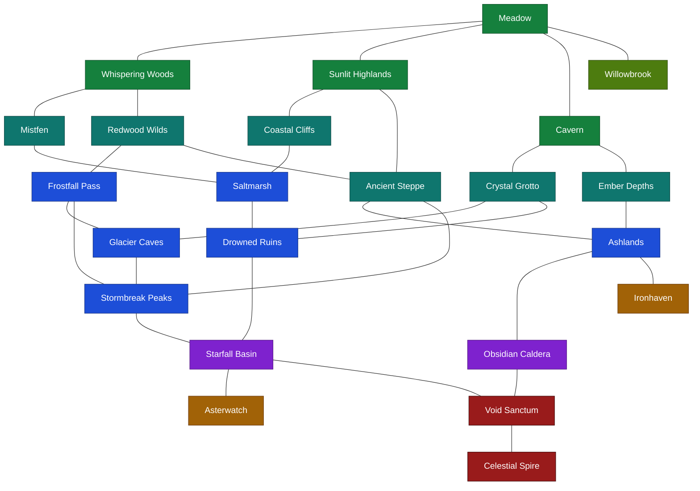

# Bundled world

The bundled game contains 23 connected areas. New and defeated players appear
in Willowbrook. Difficulty is not hard-gated, but enemy health, damage,
experience, population, and respawn timing increase along the natural routes
beyond Meadow.

## Area graph

Every line represents a bidirectional waypoint connection.

## Progression bands

| Band | Areas |
|---|---|
| Starting settlement | Willowbrook |
| First wilderness hub | Meadow |
| Early branches | Whispering Woods, Sunlit Highlands, Cavern |
| Developing routes | Mistfen, Redwood Wilds, Coastal Cliffs, Ancient Steppe, Crystal Grotto, Ember Depths |
| Advanced regions | Saltmarsh, Frostfall Pass, Drowned Ruins, Glacier Caves, Ashlands, Stormbreak Peaks, Ironhaven |
| Convergence | Obsidian Caldera, Starfall Basin, Asterwatch |
| Endgame | Void Sanctum, Celestial Spire |

## Towns

| Town | Access | Services |
|---|---|---|
| Willowbrook | Meadow | Early shop and three quest givers |
| Ironhaven | Ashlands | Mid-game consumables, equipment, and three quest givers |
| Asterwatch | Starfall Basin | Late-game equipment and three quest givers |

Town NPCs gather in open market and workshop shelters around shared public
spaces rather than occupying individual houses. Each settlement also includes
communal fixtures and unoccupied buildings that give it a distinct town
silhouette.

Additional quest givers live outside towns in Mistfen, Frostfall Pass, Drowned
Ruins, and Obsidian Caldera.

## Area scale

The bundled areas use different footprints based on their role:

| Area type | Size |
|---|---:|
| Towns | 160 × 56 |
| Meadow, Cavern, and early wilderness | 192 × 64 |
| Mid-game wilderness | 224 × 72 |
| Late-game wilderness | 256 × 80 |
| Celestial Spire | 208 × 72 |

Enemy roaming regions and terrain features extend into the additional space.
Travel waypoints sit near the relevant area boundaries rather than remaining
clustered around the original small layouts.

## Encounter distribution

Towns are safe and contain no enemy spawns. Every wilderness area has three
non-overlapping roaming regions distributed across its footprint, rather than
one encounter region concentrated near the entrance.

Early and mid-game regions generally support three enemies per roaming region.
Late-game regions use smaller groups of stronger enemies, and Celestial Spire
uses one enemy per region. Transitional areas mix species from neighboring
biomes so the routes blend together instead of changing encounters abruptly.

## Route themes

- The woodland route runs through Whispering Woods and Redwood Wilds into
  Frostfall Pass and Glacier Caves.
- The highland route runs through Sunlit Highlands and Ancient Steppe into
  Ashlands and Obsidian Caldera.
- The underground route splits at Cavern toward Crystal Grotto and Ember
  Depths, reconnecting with the frozen and volcanic routes.
- The wetland route joins Mistfen and Coastal Cliffs at Saltmarsh before
  reaching Drowned Ruins.
- Ancient Steppe and Stormbreak Peaks serve as multi-exit hubs.
- Advanced routes reconverge at Starfall Basin and Void Sanctum before the
  final ascent to Celestial Spire.
- Willowbrook, Ironhaven, and Asterwatch branch from the main routes as safe
  service areas, so visiting a town does not replace a wilderness connection.

All areas are reachable from Willowbrook, and every connection has a configured
return route.
